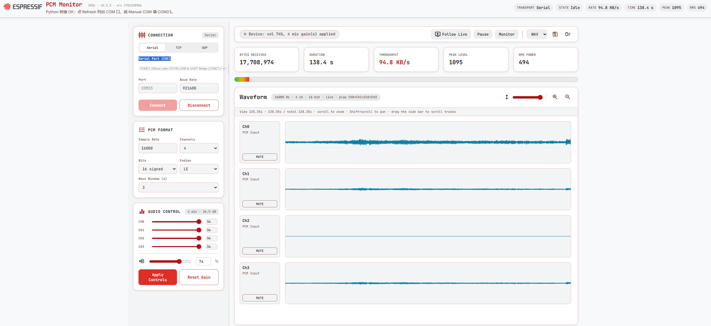

# PCM Monitor（PC 端）

本目录为 **esp_audio_pcm_toolkit** 组件的 PC 端工具，与设备端 `esp_audio_pcm_*` API 配套使用。

通过 **Serial / TCP / UDP** 接收 ESP 固件输出的 PCM，在 PC 上显示波形、实时试听、保存 WAV，并下发 `vol` / `gain` / `gch` 控制命令。



*PC 端界面示意：左侧 Connection / PCM Format / Audio Control，右侧实时统计与多通道波形（每轨可 MUTE）。*

---

## 使用说明

### 启动

**Windows：双击 `start_monitor.bat`**，浏览器会自动打开（URL 带 `?v=` 防缓存）。

**Linux / macOS：**

```bash
chmod +x start_monitor.sh   # 首次
./start_monitor.sh
```

脚本会自动安装 `pyserial`、扫描串口、启动桥接并打开浏览器。按 **Ctrl+C** 停止桥接。

也可手动启动：

```bash
pip install pyserial
python3 pcm_serial_bridge.py
# 浏览器打开终端里打印的 http://127.0.0.1:8765/...
```

> 不要直接双击 `.html`（`file://` 无法使用串口）。更新页面后请 **关闭旧的桥接进程/终端窗口**，再重新运行启动脚本。

---

### 1. 传输模式（Serial / TCP / UDP）

左侧 **Connection** 卡片顶部为分段按钮 **Serial / TCP / UDP**。选 TCP/UDP 时隐藏串口区，显示 **PC 本机 IP**（PCM 监听端口固定 **8766**，与固件 menuconfig 默认一致，页面上不单独显示）。

| 模式 | 架构 | 典型场景 | 网页操作 |
|------|------|----------|----------|
| **Serial (USB/UART)** | ESP → PC 单向字节流 | USB 直连、外接 USB-UART | 选串口 → **Connect** |
| **TCP** | **PC = Server，ESP = Client**，全双工 | WiFi 板卡，需稳定连接与控制回传 | 选 TCP → **Start TCP Server** |
| **UDP** | **PC = Server**，ESP 发包；控制命令 UDP 回包 | WiFi 调试，无连接态 | 选 UDP → **Start UDP Server** |

#### Serial（USB / UART）

1. 传输方式选 **Serial**
2. **Serial Port** 下拉选串口（Windows `COM23`，Linux `/dev/ttyACM0`），点右侧 **Refresh** 图标刷新列表
   - 列表为空时自动显示 **Manual Port** 手填区
   - 有串口时默认隐藏手填；可点 **Enter port manually…** 展开
   - 端口名过长时会截断显示，悬停可看全名
3. **Baud Rate**（须与固件一致）：

   | 固件传输 | 固件默认 | monitor 建议填写 |
   |----------|----------|------------------|
   | **USB Serial/JTAG** | — | **115200**（CDC 握手用，与 PCM 吞吐无关） |
   | **硬件 UART** | **921600**（Kconfig `ESP_AUDIO_PCM_UART_BAUD`） | **921600** |

4. 点 **Connect**；工具栏显示绿色 **STREAMING**，波形开始滚动
5. **使用前**：烧好固件、关闭 `idf.py monitor`，且 PCM 链路上须 `esp_log_level_set("*", ESP_LOG_NONE)`（见下文「Serial 注意」）

#### TCP / UDP（WiFi）

架构：**PC 作 Server，ESP 作 Client**（同一 WiFi / 局域网）。

1. 传输方式选 **TCP** 或 **UDP**
2. PCM 端口默认为 **8766**（须与设备 menuconfig 一致；网页内置，无需手填）
3. 在 **PC 本机 IP** 列表中选与 ESP **同网段** 的地址（多网卡时可手动覆盖）
4. 点 **Start TCP Server** / **Start UDP Server**
5. 设备 menuconfig 配置：
   - `ESP Audio PCM Toolkit → PCM stream transport` → TCP 或 UDP
   - `PC monitor server IP` → 网页上显示的 PC IP
   - 端口与网页一致
6. 设备上电连 WiFi 后自动推 PCM；状态栏显示 **设备已连接**

**停止 / 再开 Server**

| 模式 | 设备是否要重启 |
|------|----------------|
| TCP | 一般 **不用**；设备下次发 PCM 会自动重连 |
| UDP | **不用**；继续发包即可 |

桥接黑窗口会打印本机 IP；也可访问 `http://127.0.0.1:8765/api/version` 确认桥接版本（含 `modes: serial/tcp/udp`）。

#### 音频参数（三种模式通用）

须与固件一致，否则波形/试听/保存都会错：

| 参数 | 常见值 | 说明 |
|------|--------|------|
| Sample Rate | **16000** | 采样率 Hz，**不是**串口波特率 |
| Channels | **1–8**（默认 4） | 多通道交错 PCM |
| Bits | **16** | 有符号 16 位 |
| Endian | **Little-endian** | 小端 |
| Wave Window | 1–8 s | 波形可见时间窗口 |

交错格式：`Ch0_s0, Ch1_s0, Ch2_s0, …, Ch0_s1, Ch1_s1, …`

#### Serial 注意：固件必须关闭 Log

USB/UART 口传的是**纯 PCM 二进制**，任何日志文字混进去都会导致波形乱码。

TCP/UDP 网络口不经过 USB CDC，Console/Log 可仍走 UART；但 **PCM 链路上仍不要打印 Log**。

```c
esp_log_level_set("*", ESP_LOG_NONE);
```

---

### 2. 波形与实时播放（含 MUTE）

#### 波形

- 每通道一行：左侧 **CHn** 侧栏 + 右侧网格波形区；标题栏 **高度滑块** 可调节轨高（40–400 px）
- 滚轮缩放、**Shift + 滚轮** 平移；轨道列表可滚动（最多 8 通道）
- **Follow Live**：回到实时末尾
- **Pause**：冻结波形与录制缓冲（不再追加新数据）

#### 实时播放

1. **先连接**（Serial 已连，或 TCP/UDP 设备已连），确认波形在动
2. 点 **Monitor**（须用户点击，浏览器才允许出声）
3. 浏览器内混合播放当前未静音的通道；Peak / RMS 电平表与试听一致

#### MUTE（每轨侧栏按钮）

每条波形轨左侧侧栏有 **MUTE** 按钮：

| 状态 | 说明 |
|------|------|
| 默认 | 全部通道出声 |
| 点 **MUTE** | 该通道静音：按钮显示 **MUTED**（淡色虚线边框），整轨变灰、波形区半透明并叠 **MUTED** 水印 |
| 再点 | 取消静音，恢复参与试听 |

**典型用法**：4 麦时 Ch0 无信号、Ch2 有声音 → 对 Ch0/Ch1/Ch3 点 **MUTE**，只留 Ch2 试听。

波形标题徽章会显示当前参与播放的通道，例如 `play Ch2` 或 `play Ch1+Ch2`。

---

### 3. 保存 WAV 并用 Audacity 查看

Monitor 会把**当前缓冲**（连接后收到、且未被「暂停」丢弃的部分）导出为标准 WAV，可直接用 [Audacity](https://www.audacityteam.org/) 打开做进一步分析。

#### 操作步骤

1. 连接设备，确认 **Sample Rate / Channels / Bits** 与固件一致
2. 录制一段时间（波形在滚动；若需固定片段可先 **Pause** 再保存）
3. 工具栏选择 **WAV** 或 **PCM**，点 **Save** 图标保存
4. 打开 **Audacity** → **文件 → 打开**，选中刚保存的 `.wav`（PCM 需用「导入原始数据」）

#### 在 Audacity 里

- 多通道 WAV 会显示为**多条轨**（与 monitor 网页分轨一致）
- 可单独 **Solo / Mute** 某轨、放大某段、看频谱（**分析 → 绘制频谱**）
- 若打开后无声或时长不对，回到 monitor 核对 **16000 Hz / 通道数 / 16-bit** 是否与固件一致

#### 命令行录 PCM（不经网页）

```bash
python3 usb_pcm_capture.py -p COM23 -o capture.pcm -c 4 --rate 16000
# Linux 示例：-p /dev/ttyACM0
# UART 硬件串口时，脚本内 baud 须改为 921600，或直接用 pyserial：
#   serial.Serial("COM5", baudrate=921600, timeout=0.02)
```

得到原始 `.pcm` 时，可在 Audacity 用 **文件 → 导入 → 原始数据** 导入，并手动设：编码 **Signed 16-bit PCM**、字节序 **Little-endian**、通道数与采样率。  
**推荐直接用网页 Save WAV**，已带好 WAV 头，Audacity 开箱即开。

---

### 4. 设备控制（音量 / 增益）

连接 Serial / TCP / UDP 后，左侧 **Audio Control** 面板可用：

- **播放音量** 0–100（%）
- **CH0 – CHn** mic 增益滑条（通道数跟随 **Channels**，与 `gch 0`… 对应）

**重要：拖动滑条不会立刻生效**，须再点 **Apply Controls**，才会发送 `vol` / `gch` 命令（适用于三种传输方式）。**Reset Gain** 可恢复默认增益。

| 命令 | 说明 |
|------|------|
| `vol 70` | 播放音量 0–100 |
| `gch 0 30.0` | Ch0 增益 dB |
| `gch 1 30.0` | Ch1 |
| `gain 30.0` | 所有通道同一增益 |

---

## 工具脚本

### 方式一：启动脚本（推荐）

| 脚本 | 平台 | 作用 |
|------|------|------|
| **`start_monitor.bat`** | Windows | 启动桥接，自动打开浏览器 |
| **`start_monitor.sh`** | Linux / macOS | 同上 |
| **`list_ports.bat`** | Windows | 查看串口（排查用） |

### 方式二：命令行

```bash
# 启动监控（全平台）
python3 pcm_serial_bridge.py

# 查看串口
python3 list_ports.py

# 录 PCM 到文件（不打开网页）
python3 usb_pcm_capture.py -p COM23 -o capture.pcm -c 4 --rate 16000
# Linux 示例：-p /dev/ttyACM0
```

Windows 下若 `python3` 不可用，可改为 `python` 或 `py -3`。

---

## 网页功能速查

页面为 **PCM Monitor Dashboard** 布局（Google Stitch 设计规范）：顶栏状态 pills + **左侧控制卡片** + **右侧数据区**（窄屏堆叠为单列）。需联网加载 Google Fonts（Inter / JetBrains Mono / Material Icons）。


| 区域 | 内容 |
|------|------|
| 顶栏 | Espressif 标识、Transport/State/Rate 等状态 pills |
| 左侧 | Connection（Serial/TCP/UDP）、PCM Format、Audio Control |
| 右侧 | 吞吐统计卡片、多通道波形（MUTE / Follow Live / Monitor / Save） |

### 顶栏

| 功能 | 说明 |
|------|------|
| 状态 pills | Transport / State / Rate / Time / Peak / RMS 实时摘要 |

### 左侧：控制区

| 功能 | 说明 |
|------|------|
| Connection | Serial / TCP / UDP、PC 本机 IP、串口下拉 + Refresh、Baud Rate、Connect（详见 §1） |
| PCM Format | Sample Rate / Channels(1–8) / Bits / Endian / Wave Window |
| Audio Control | 播放音量、CHn 增益、**Apply Controls** / **Reset Gain**（详见 §4） |

### 右侧：数据区

| 功能 | 说明 |
|------|------|
| 工具栏 | STREAMING 状态、Follow Live / Pause / Monitor、WAV/PCM 导出、Save / Clear |
| 统计卡片 | Bytes / Duration / Throughput / Peak / RMS + 渐变电平条 |
| 波形 | 多通道分轨侧栏 + 网格绘图；高度滑块、缩放按钮；**MUTE**（详见 §2） |

> Save 可导出 WAV 或原始 PCM（详见 §3）。

---

## 常见问题

### 改了音量/增益，设备没反应

- 网页滑条**不会自动下发**；改完后必须点 **Apply Controls**
- 确认已连接（Serial 已连 COM，或 TCP/UDP 已显示「设备已连接」）
- 串口模式下确认 `idf.py monitor` 未占用 COM

### 页面显示「页面初始化失败」

- 确认通过 `start_monitor.bat` / `start_monitor.sh` 打开的 URL 访问，而非旧书签或 `file://`
- 关闭浏览器标签页，重新运行启动脚本
- 按 F12 查看 Console 是否有报错

### 页面仍是旧版

1. 关闭浏览器标签页
2. 停止旧桥接（关闭 **PCM Monitor** 终端，或 `pkill -f pcm_serial_bridge.py`）
3. 重新运行 **`start_monitor.bat`** / **`start_monitor.sh`**
4. 使用终端里带 **`?v=`** 的 URL；标题应为 **PCM Monitor Dashboard**

### COM 口列表为空

1. 运行 `list_ports.bat` 或 `python3 list_ports.py` 查看系统是否识别端口
2. 检查 USB 线、设备管理器 → **端口 (COM 和 LPT)**
3. 关闭 `idf.py monitor` 及其他占用 COM 的程序
4. 手动输入 `COMxx` / `/dev/ttyACM0`（列表为空时自动显示 Manual Port，或点 **Enter port manually…**）→ **Connect**

### 波形异常（块状、乱码、有文字）

- **最常见原因：固件 Log 没关干净**，检查是否已 `esp_log_level_set("*", ESP_LOG_NONE)`
- 确认 PCM 和 Log/Console 没有共用同一个 USB CDC 口
- 确认 Sample Rate 填 **16000**，不要填 115200
- **UART 模式**：确认 Baud Rate 为 **921600**（或与 menuconfig 一致），不要用 USB 的 115200

### TCP/UDP：一直「等待设备连接」

- PC 与 ESP 是否同一网段（PC IP 是否选对）
- 设备 menuconfig **Server IP / 端口** 是否与网页一致
- 设备 WiFi 是否已连接（串口 log 应有 `got ip`）
- PC 防火墙是否放行入站 **8766**（或你设的端口）
- 先点网页 **启动 Server**，再让设备 `esp_audio_pcm_open()`

### 端口被占用（WinError 10013）

桥接会自动尝试 8765、8766、8767 等端口。以 `monitor.url` 或桥接窗口输出的 URL 为准。

### 无声音（实时播放）

1. **先连接**，波形要在动，再点 **Monitor**
2. 检查各轨 **MUTE** 是否误静音（默认全部出声）
3. **Sample Rate** 填 **16000**，**Channels** 与固件一致
4. 系统音量、浏览器标签页勿静音；用 `start_monitor.bat` / `start_monitor.sh` 打开（`http://127.0.0.1`）
5. 仍无声：F12 → Console 查看 AudioContext 报错

### Save WAV 在 Audacity 里打不开或不对

- 保存前确认 **Sample Rate / Channels / Bits** 与固件一致
- 优先用 **Save WAV** 直接打开；不要用错误参数导入原始 `.pcm`
- 若只有 `.pcm`，Audacity 导入时选 **Signed 16-bit PCM、Little-endian**，并填对通道数与采样率

---

## 依赖

- Python 3.8+
- `pyserial`（`start_monitor.bat` / `start_monitor.sh` 会自动安装）
- 浏览器：Chrome 或 Edge（Web Serial / 音频播放）
- 可选：`pywebview`（仅 `pcm_serial_monitor.py` Native 模式需要）
- 网页字体：需能访问 `fonts.googleapis.com`（或自行离线化字体）

---

## 固件侧参考

推荐使用本组件 **`esp_audio_pcm_*` API**（`esp_audio_pcm_config_default()` 跟随 menuconfig 选传输方式）。

| 方式 | 底层 | 典型场景 |
|------|------|----------|
| **USB Serial/JTAG** | `esp_driver_usb_serial_jtag` | USB 直连 ESP（S3/C3/C5 等） |
| **UART** | `esp_driver_uart` | 外接 USB-UART 或第二路 UART |
| **TCP** | `lwip` socket，connect PC Server | WiFi 板卡，PC 跑 pcm_monitor |
| **UDP** | `lwip` socket，sendto PC Server | 同上；无连接态，适合调试 |

**Serial**：发 PCM 的那一路不能混 Log/Console 文本。  
**TCP/UDP**：应用需先初始化 WiFi；PCM 与控制命令共用同一传输（TCP 全双工；UDP 同 socket 收控制）。

### 组件 API 示例（推荐）

```c
#include "esp_audio_pcm.h"

esp_audio_pcm_config_t cfg = esp_audio_pcm_config_default();
ESP_ERROR_CHECK(esp_audio_pcm_new(&cfg, &pcm));
ESP_ERROR_CHECK(esp_audio_pcm_open(pcm));   /* TCP: connect; UDP: bind+resolve */
esp_audio_pcm_write(pcm, buf, len, 20);
```

menuconfig：`Component config → ESP Audio PCM Toolkit`。

---

## 固件侧：USB Serial/JTAG（init / write）

PC 端 monitor 接收的是 ESP 经 **USB CDC（Serial/JTAG）** 发出的原始 PCM 字节流。固件侧使用 ESP-IDF 驱动 `esp_driver_usb_serial_jtag`。

### 适用芯片

ESP32-S3、ESP32-C3、ESP32-C5、ESP32-C6、ESP32-H2 等带 **USB Serial/JTAG** 外设的芯片（一根 USB 线同时用于烧录、JTAG 和 CDC 串口）。

### CMake 依赖

`main/CMakeLists.txt` 中增加：

```cmake
idf_component_register(SRCS "main.c"
                       REQUIRES esp_driver_usb_serial_jtag ...)
```

头文件：

```c
#include "driver/usb_serial_jtag.h"
#include "freertos/FreeRTOS.h"
#include "freertos/task.h"
```

### 初始化（install）

在 `app_main()` 里、开始收发数据**之前**调用一次 `usb_serial_jtag_driver_install()`：

```c
void app_main(void)
{
    /* 发送 PCM 时 tx 缓冲建议 >= 一帧音频数据大小 */
    usb_serial_jtag_driver_config_t usb_cfg = {
        .rx_buffer_size = 256,    /* PC -> ESP 接收缓冲，仅发 PCM 可较小 */
        .tx_buffer_size = 4096,   /* ESP -> PC 发送缓冲，PCM 流建议 4096+ */
    };
    ESP_ERROR_CHECK(usb_serial_jtag_driver_install(&usb_cfg));
}
```

也可用默认宏（缓冲各 256 字节，发 PCM 通常偏小）：

```c
usb_serial_jtag_driver_config_t usb_cfg = USB_SERIAL_JTAG_DRIVER_CONFIG_DEFAULT();
ESP_ERROR_CHECK(usb_serial_jtag_driver_install(&usb_cfg));
```

卸载（一般很少需要）：

```c
ESP_ERROR_CHECK(usb_serial_jtag_driver_uninstall());
```

### 发送 PCM（write，本工程主要用法）

`usb_serial_jtag_write_bytes()` 把数据拷入 TX 环形缓冲，ISR 再送入 USB FIFO。返回值是**实际写入缓冲的字节数**，可能小于请求长度；返回 `-1` 且 `errno` 为 `EAGAIN`/`ENOMEM` 表示缓冲满。

**多通道示例**（4 ch，带重试）：

```c
static esp_err_t usb_send_audio(const void *data, size_t len)
{
    for (int retry = 0; retry < 8; retry++) {
        int sent = usb_serial_jtag_write_bytes(data, len, pdMS_TO_TICKS(20));
        if (sent == (int)len) {
            return ESP_OK;
        }
        if (sent >= 0) {
            continue;  /* 部分写入，可再试或做分段发送 */
        }
        if (errno != ENOMEM && errno != EAGAIN) {
            return ESP_FAIL;
        }
        vTaskDelay(pdMS_TO_TICKS(1 + retry));
    }
    return ESP_ERR_NO_MEM;
}

/* 录音循环：codec 读一帧 -> 直接 USB 发出 */
while (!stop) {
    esp_codec_dev_read(record_dev, buffer, sizeof(buffer));
    usb_send_audio(buffer, sizeof(buffer));
}
```

**单声道示例**（带分段发送）：

```c
static esp_err_t usb_send_pcm(const void *data, size_t len)
{
    const uint8_t *ptr = data;
    size_t remaining = len;

    for (int retry = 0; retry < 16 && remaining > 0; retry++) {
        int sent = usb_serial_jtag_write_bytes((const char *)ptr, remaining,
                                               pdMS_TO_TICKS(50));
        if (sent > 0) {
            ptr += sent;
            remaining -= sent;
            retry = 0;
            continue;
        }
        if (sent < 0 && errno != EAGAIN && errno != ENOMEM) {
            return ESP_FAIL;
        }
        vTaskDelay(pdMS_TO_TICKS(1 + retry));
    }
    return remaining == 0 ? ESP_OK : ESP_ERR_TIMEOUT;
}
```

需要确保本批数据全部到达 host 时，可在写完后调用：

```c
usb_serial_jtag_wait_tx_done(pdMS_TO_TICKS(100));
```

### 从 PC 读取数据（read）

若需接收 PC 下发的命令或二进制数据，使用 `usb_serial_jtag_read_bytes()`：

```c
#define RX_BUF_SIZE 256

static void usb_rx_task(void *arg)
{
    uint8_t buf[RX_BUF_SIZE];

    while (1) {
        /* 阻塞等待，最多 100ms */
        int n = usb_serial_jtag_read_bytes(buf, sizeof(buf), pdMS_TO_TICKS(100));
        if (n > 0) {
            /* 处理 buf[0..n-1] */
        } else if (n == 0) {
            /* 超时，无数据 */
        }
        /* n < 0 表示错误 */
    }
}

void app_main(void)
{
    usb_serial_jtag_driver_config_t cfg = {
        .rx_buffer_size = 512,
        .tx_buffer_size = 4096,
    };
    ESP_ERROR_CHECK(usb_serial_jtag_driver_install(&cfg));
    xTaskCreate(usb_rx_task, "usb_rx", 4096, NULL, 5, NULL);
}
```

回显示例（echo）：

```c
uint8_t buf[64];
int n = usb_serial_jtag_read_bytes(buf, sizeof(buf), pdMS_TO_TICKS(10));
if (n > 0) {
    usb_serial_jtag_write_bytes(buf, n, pdMS_TO_TICKS(100));
}
```

### 与 printf / Console 的关系

**原则：USB 发 PCM 期间，所有 Log 必须关闭。**

```c
/* 打开 codec、开始 USB 发 PCM 之前 */
esp_log_level_set("*", ESP_LOG_NONE);
```

| 场景 | 建议 |
|------|------|
| USB 专用于 PCM | 必须 `ESP_LOG_NONE`，禁止 `ESP_LOGx` / `printf` 走 USB |
| Console 走 UART，USB 走 PCM | Log 可打 UART，但 USB 侧仍不要有任何文本输出 |
| Console 也走 USB Serial/JTAG | 必须先关 Log，或改 Console 到 UART；**PCM 与日志不能混用同一端口** |

本 monitor 假设收到的是**纯 PCM**；一行 Log 就会破坏波形。

### PC 端对应读法

Python（`pcm_serial_bridge.py` / `usb_pcm_capture.py`）：

```python
import serial
ser = serial.Serial("COM23", baudrate=115200, timeout=0.02)
data = ser.read(4096)   # 原始 PCM 字节
```

波特率 115200 只是 CDC 默认配置，PCM 吞吐不依赖该数值；PC 按**字节流**连续读取即可。

### 数据格式约定

与 monitor 页面参数一致：

- 16 kHz 采样率
- 16 bit 有符号，小端
- 多通道交错：`ch0_s0, ch1_s0, ch2_s0, …, ch0_s1, ch1_s1, …`
- 通道数由固件决定（1–8，页面 Channels 与之对齐）

### 相关 API 速查

| API | 作用 |
|-----|------|
| `usb_serial_jtag_driver_install()` | 安装驱动，配置 TX/RX 缓冲 |
| `usb_serial_jtag_write_bytes()` | ESP → PC 发送 |
| `usb_serial_jtag_read_bytes()` | PC → ESP 接收 |
| `usb_serial_jtag_wait_tx_done()` | 等待 TX 发完 |
| `usb_serial_jtag_is_connected()` | USB 是否连上 host（收到 SOF） |
| `usb_serial_jtag_driver_uninstall()` | 卸载驱动 |

官方头文件：[usb_serial_jtag.h](https://github.com/espressif/esp-idf/blob/master/components/esp_driver_usb_serial_jtag/include/driver/usb_serial_jtag.h)

---

## 固件侧：UART（init / write）

若 PCM 走 **硬件 UART**（如 UART1 + USB-UART 转接），使用 ESP-IDF `esp_driver_uart` 驱动，或通过 **`esp_audio_pcm_*` API**（menuconfig 选 UART，默认 **921600** baud）。

### 适用场景

- 板子无 USB Serial/JTAG，或 USB 已被 Console 占用
- 需要独立调试口：**UART0 = Console/Log**，**UART1 = PCM 流**

### CMake 依赖

```cmake
idf_component_register(SRCS "main.c"
                       REQUIRES esp_driver_uart esp_audio_pcm_toolkit ...)
```

头文件：

```c
#include "esp_audio_pcm.h"
```

### 使用组件 API（推荐）

```c
esp_audio_pcm_config_t cfg = esp_audio_pcm_config_default();  /* menuconfig: UART, 921600 */
ESP_ERROR_CHECK(esp_audio_pcm_new(&cfg, &pcm));
ESP_ERROR_CHECK(esp_audio_pcm_open(pcm));

while (!stop) {
    esp_codec_dev_read(record_dev, buffer, sizeof(buffer));
    esp_audio_pcm_write(pcm, buffer, sizeof(buffer), 20);
}
```

menuconfig 可调：`UART port` / `TX GPIO` / `RX GPIO` / **`UART baud rate`（默认 921600）** / TX buffer。

### 直接调用 UART 驱动（底层参考）

```c
#define PCM_UART        UART_NUM_1
#define PCM_UART_TX     GPIO_NUM_17   /* 按板级原理图修改 */
#define PCM_UART_BAUD   921600        /* 见下方波特率说明 */

#define UART_RX_BUF     256
#define UART_TX_BUF     4096

static esp_err_t pcm_uart_init(void)
{
    uart_config_t cfg = {
        .baud_rate = PCM_UART_BAUD,
        .data_bits = UART_DATA_8_BITS,
        .parity    = UART_PARITY_DISABLE,
        .stop_bits = UART_STOP_BITS_1,
        .flow_ctrl = UART_HW_FLOWCTRL_DISABLE,
        .source_clk = UART_SCLK_DEFAULT,
    };

    ESP_ERROR_CHECK(uart_param_config(PCM_UART, &cfg));
    ESP_ERROR_CHECK(uart_set_pin(PCM_UART, PCM_UART_TX, UART_PIN_NO_CHANGE,
                                 UART_PIN_NO_CHANGE, UART_PIN_NO_CHANGE));
    ESP_ERROR_CHECK(uart_driver_install(PCM_UART, UART_RX_BUF, UART_TX_BUF,
                                        0, NULL, 0));
    return ESP_OK;
}
```

### 波特率估算

PCM 字节率 = `sample_rate × channels × (bits/8)`

| 格式 | 字节率 | 建议波特率 |
|------|--------|-----------|
| 16 kHz / 4 ch / 16 bit | 128000 B/s | **≥ 921600**（留余量） |
| 16 kHz / 1 ch / 16 bit | 32000 B/s | 115200 可勉强，建议 460800+ |

USB CDC 下波特率几乎不影响吞吐；**硬件 UART 必须选足够高的 baud**，否则 TX 缓冲会满、丢样。PC monitor **Baud Rate 须与固件一致**（默认 **921600**）。

### 发送 PCM（write）

```c
static esp_err_t uart_send_pcm(const void *data, size_t len)
{
    const uint8_t *ptr = data;
    size_t remaining = len;

    for (int retry = 0; retry < 16 && remaining > 0; retry++) {
        int sent = uart_write_bytes(PCM_UART, (const char *)ptr, remaining);
        if (sent > 0) {
            ptr += sent;
            remaining -= sent;
            retry = 0;
            continue;
        }
        vTaskDelay(pdMS_TO_TICKS(1 + retry));
    }
    return remaining == 0 ? ESP_OK : ESP_ERR_TIMEOUT;
}
```

### 与 Log / Console 的关系

**PCM 和 Log 不能共用同一路 UART。**

| 布局 | 说明 |
|------|------|
| UART0 = Console，UART1 = PCM | 推荐；Log 走 UART0，PCM 走 UART1 |
| 单 UART 既 Console 又 PCM | 不可行，Log 会污染波形 |
| 发 PCM 前 | 该 UART 上 `esp_log_level_set("*", ESP_LOG_NONE)`，且不要 `printf` |

### PC 端连接

monitor 选 USB-UART 对应的 COM 口，**Baud Rate 填与固件一致的值（默认 921600）**：

```python
import serial
ser = serial.Serial("COM5", baudrate=921600, timeout=0.02)
data = ser.read(4096)
```

### 相关 API 速查

| API | 作用 |
|-----|------|
| `uart_param_config()` | 波特率、数据位、校验等 |
| `uart_set_pin()` | TX/RX/RTS/CTS 引脚 |
| `uart_driver_install()` | 安装驱动、分配缓冲 |
| `uart_write_bytes()` | ESP → PC 发送 |
| `uart_read_bytes()` | PC → ESP 接收 |
| `uart_wait_tx_done()` | 等待 TX 发完 |
| `uart_driver_delete()` | 卸载驱动 |

官方头文件：[uart.h](https://github.com/espressif/esp-idf/blob/master/components/esp_driver_uart/include/driver/uart.h)
